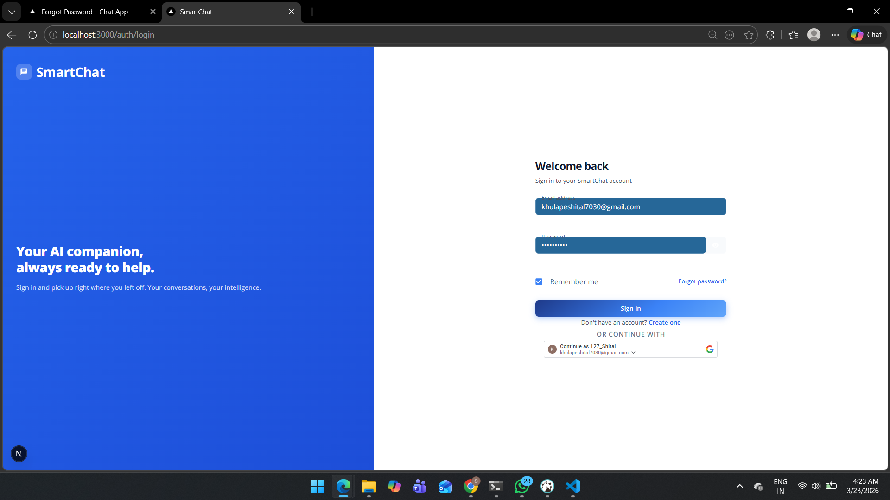
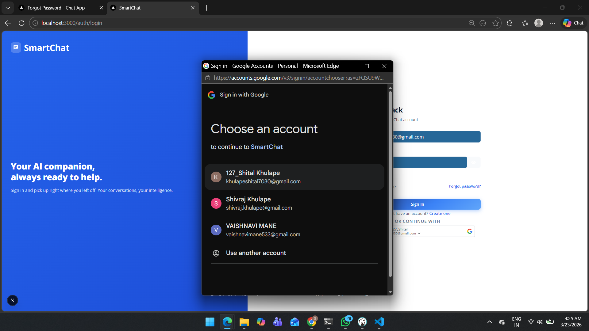
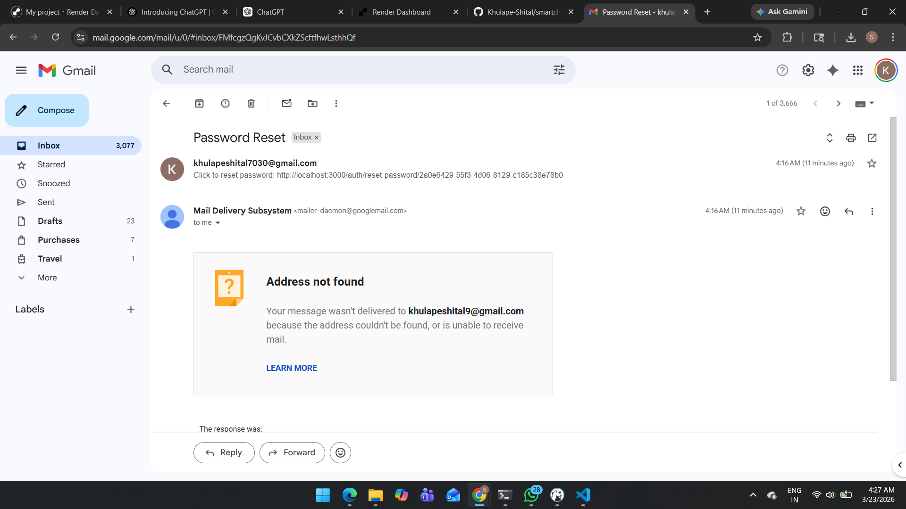
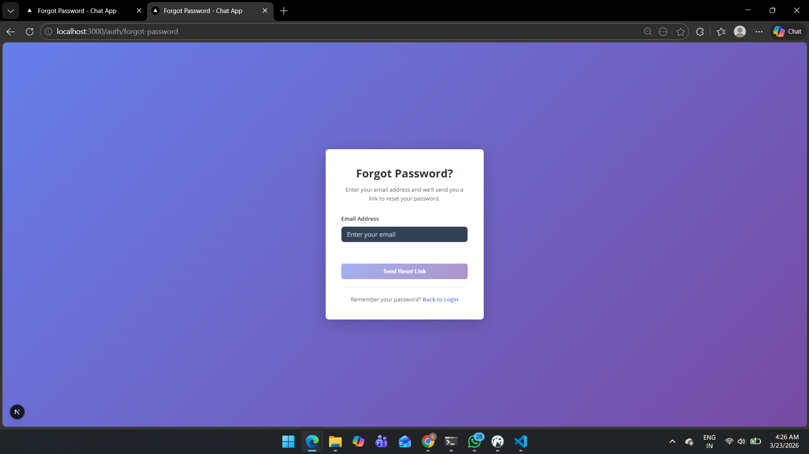
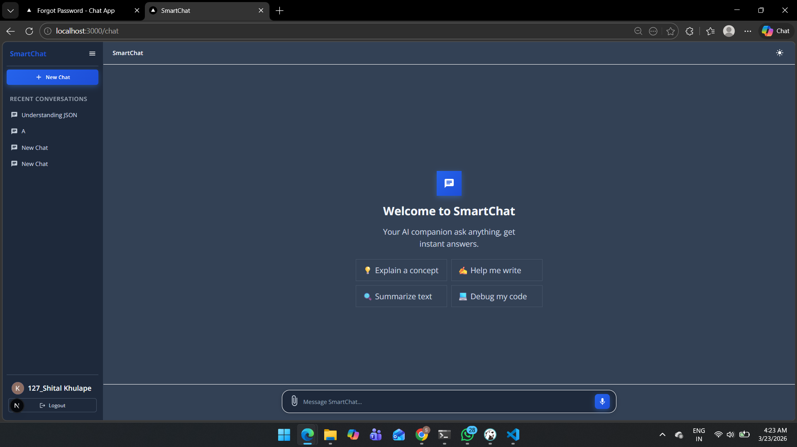
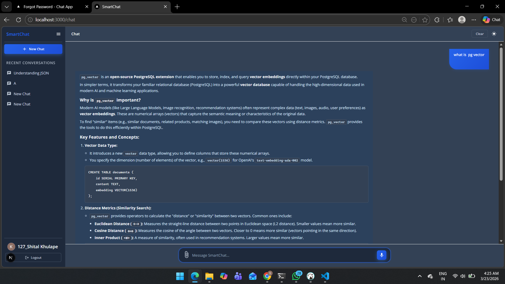

# SmartChat Frontend

A modern, AI-powered chat application frontend built with **Next.js**, **React**, and **Material-UI**. Features real-time streaming responses, file uploads, email verification, and a beautiful dark/light theme toggle.

## 🚀 Features

- ✅ **Real-time Streaming Chat** - See AI responses appear word-by-word
- ✅ **File Upload Support** - Upload images, PDFs, and text files
- ✅ **Email Verification** - Secure registration with email verification
- ✅ **Password Reset** - Forgot password flow with email verification
- ✅ **Dark/Light Theme** - Toggle between dark and light modes
- ✅ **Chat History** - Maintain multiple chat sessions
- ✅ **Message Editing** - Edit messages and regenerate AI responses
- ✅ **Message Feedback** - Like/dislike AI responses
- ✅ **Google OAuth** - Sign in with Google
- ✅ **RAG (Retrieval Augmented Generation)** - Ask questions about uploaded documents
- ✅ **Responsive Design** - Works on desktop, tablet, and mobile
- ✅ **Token Management** - Automatic token refresh and secure storage

## 📋 Tech Stack

| Technology | Purpose |
|-----------|---------|
| **Next.js 14+** | React framework with SSR, API routes, middleware |
| **React 18+** | UI component library |
| **Material-UI (MUI)** | Pre-built components and styling |
| **Axios** | HTTP client with interceptors |
| **React Markdown** | Render markdown in chat messages |
| **Next Navigation** | Client-side routing |

## 📁 Project Structure

```
frontend/
├── src/
│   ├── app/
│   │   ├── api/              # API route handlers
│   │   ├── auth/             # Authentication pages (login, register, reset, verify)
│   │   ├── chat/             # Main chat page
│   │   ├── globals.css       # Global styles
│   │   ├── layout.js         # Root layout with providers
│   │   ├── page.js           # Home page
│   │   └── page.module.css   # Home page styles
│   ├── components/
│   │   ├── auth/             # Auth-related components (forms, buttons)
│   │   ├── layout/           # Layout components
│   │   ├── messages/         # Message bubble and related components
│   │   ├── sidebar/          # Chat sidebar
│   │   ├── TextField/        # Chat input component
│   │   └── ui/               # Reusable UI components
│   ├── context/
│   │   ├── AuthContext.js    # Authentication state management
│   │   └── ThemeContext.js   # Theme state management
│   ├── hooks/
│   │   ├── useAuth.js        # Auth hooks (login, register, logout)
│   │   ├── useChatMessages.js # Messages management
│   │   └── useChatSessions.js # Chat sessions management
│   ├── lib/
│   │   ├── constants.js      # App-wide constants
│   │   ├── muiTheme.js       # Material-UI theme config
│   │   ├── tokens.js         # Token management utilities
│   │   └── validators.js     # Form validation functions
│   ├── services/
│   │   ├── apiClient.js      # Axios client with interceptors
│   │   ├── authService.js    # Auth API calls
│   │   └── chatService.js    # Chat API calls (including streaming)
│   ├── styles/
│   │   ├── globals.css       # Global styles
│   │   └── variables.css     # CSS variables
│   └── types/
│       └── user.d.ts         # TypeScript type definitions
├── public/
│   ├── icons/                # App icons
│   └── images/               # Static images
├── .env.local                # Environment variables (local)
├── next.config.mjs          # Next.js configuration
├── middleware.js            # Next.js middleware (auth protection)
├── jsconfig.json            # JavaScript config
├── package.json             # Dependencies
├── package-lock.json        # Locked dependency versions
└── README.md                # This file
```

## ⚙️ Installation & Setup

### Prerequisites
- **Node.js** 18+ 
- **npm** or **yarn**
- Backend running at `http://127.0.0.1:8000`

### 1. Install Dependencies

```bash
cd frontend
npm install
```

### 2. Environment Configuration

Create `.env.local` in the `frontend` directory:

```env
# API Configuration
NEXT_PUBLIC_API_BASE_URL=http://127.0.0.1:8000/api

# Google OAuth (optional, for Google Sign-In)
NEXT_PUBLIC_GOOGLE_CLIENT_ID=your_google_client_id_here
```

**Environment Variables Explanation:**
- `NEXT_PUBLIC_API_BASE_URL` - Backend API base URL (must be publicly accessible in browser)
- `NEXT_PUBLIC_GOOGLE_CLIENT_ID` - Google OAuth client ID for sign-in (optional)

### 3. Run Development Server

```bash
npm run dev
```

App runs at `http://localhost:3000`

### 4. Build for Production

```bash
npm run build
npm start
```

## 🔐 Authentication Flow

### Registration
1. User fills registration form (name, email, password)
2. **Email verification** sent to user's inbox
3. User clicks verification link
4. Account activated, user redirected to login

### Login
1. User enters email and password
2. Server returns `access_token` and `refresh_token`
3. Tokens stored in `localStorage`
4. User redirected to `/chat`

### Token Management
- **Access Token** - Short-lived (30 minutes), sent with every API request
- **Refresh Token** - Long-lived (7 days), stored securely
- **Auto-Refresh** - When access token expires, refresh token automatically fetches new one
- **Logout** - Both tokens cleared, user redirected to login

**Token Storage:**
```javascript
// localStorage
localStorage.setItem('access_token', token)
localStorage.setItem('refresh_token', token)
```

## 💬 Streaming Chat API

### Send Message (with Streaming)

```javascript
import { sendMessageStream } from "@/services/chatService"

await sendMessageStream(
  chatId,           // UUID of chat session
  message,          // User message text
  file,             // Optional file upload
  (chunk) => {      // onChunk callback
    // Called when new text arrives
    setResponse(prev => prev + chunk)
  },
  (messageId) => {  // onDone callback
    // Called when streaming completes
    console.log("Message saved with ID:", messageId)
  },
  (error) => {      // onError callback
    console.error("Stream failed:", error)
  }
)
```

**Server-Sent Events Format:**
```
data: {"type": "chunk", "text": "Hello "}
data: {"type": "chunk", "text": "world"}
data: {"type": "done", "message_id": "uuid"}
data: {"type": "error", "error": "message"}
```

### Edit Message (with Streaming)

```javascript
import { editMessageStream } from "@/services/chatService"

await editMessageStream(
  messageId,
  newText,
  (chunk) => { /* handle chunk */ },
  (messageId) => { /* handle done */ },
  (error) => { /* handle error */ }
)
```

## 🎨 Theming

### Theme Configuration

Located in `src/lib/muiTheme.js`:

```javascript
// Light theme colors
light: {
  background: '#ffffff',
  text: '#000000',
  primary: '#2196F3',
}

// Dark theme colors
dark: {
  background: '#1a1a1a',
  text: '#ffffff',
  primary: '#90CAF9',
}
```

### Using Theme

```javascript
import { useTheme } from "@/context/ThemeContext"

export default function MyComponent() {
  const { theme, toggleTheme } = useTheme()
  
  return (
    <div style={{ background: theme.palette.background.default }}>
      <button onClick={toggleTheme}>Toggle Theme</button>
    </div>
  )
}
```

## � Screenshots

### Login Page


### Google Login


### Email Verification


### Forgot Password


### Chat Dashboard


### AI Response Example


## �🔄 API Client Interceptors

### Request Interceptor
- Adds `Authorization: Bearer {token}` header
- Validates token exists

### Response Interceptor
- **401 Unauthorized** → Auto-refresh token → Retry request
- **403 Forbidden** → Redirect to login
- Other errors → Pass through

## 📝 Validators

Located in `src/lib/validators.js`:

```javascript
validateName(name)           // 2-50 characters
validateEmail(email)         // Valid email format
validatePassword(password)   // 8+ chars, mixed case, numbers
validateConfirmPassword()    // Matches password
```

## 🐛 Troubleshooting

### Issue: "Failed to connect to backend"
- ✅ Ensure backend is running on `http://127.0.0.1:8000`
- ✅ Check `NEXT_PUBLIC_API_BASE_URL` in `.env.local`
- ✅ Verify CORS is enabled in backend

### Issue: "Streaming not working"
- ✅ Check browser console for errors
- ✅ Ensure Response body is being read correctly
- ✅ Verify backend sends proper SSE format: `data: {...}\n\n`

### Issue: "Token refresh loop"
- ✅ Clear localStorage: `localStorage.clear()`
- ✅ Check backend JWT_SECRET is consistent
- ✅ Verify token expiration times in backend

### Issue: "Images not loading"
- ✅ Check `media/` folder exists in backend
- ✅ Verify backend serves static files
- ✅ Check file permissions

## 🚀 Deployment

### Vercel (Recommended)

```bash
npm install -g vercel
vercel
```

Set environment variables in Vercel dashboard:
```
NEXT_PUBLIC_API_BASE_URL=https://api.yourdomain.com
```

### Docker

```dockerfile
FROM node:18-alpine
WORKDIR /app
COPY package*.json ./
RUN npm install
COPY . .
RUN npm run build
EXPOSE 3000
CMD ["npm", "start"]
```

## 📚 Additional Resources

- [Next.js Documentation](https://nextjs.org/docs)
- [React Documentation](https://react.dev)
- [Material-UI](https://mui.com)
- [Server-Sent Events](https://developer.mozilla.org/en-US/docs/Web/API/Server-sent_events)

## 🤝 Contributing

1. Create a feature branch: `git checkout -b feature/my-feature`
2. Make changes and test locally
3. Commit with clear messages: `git commit -m "Add my feature"`
4. Push to repository: `git push origin feature/my-feature`
5. Create Pull Request

## 📄 License

MIT License - See LICENSE file for details
